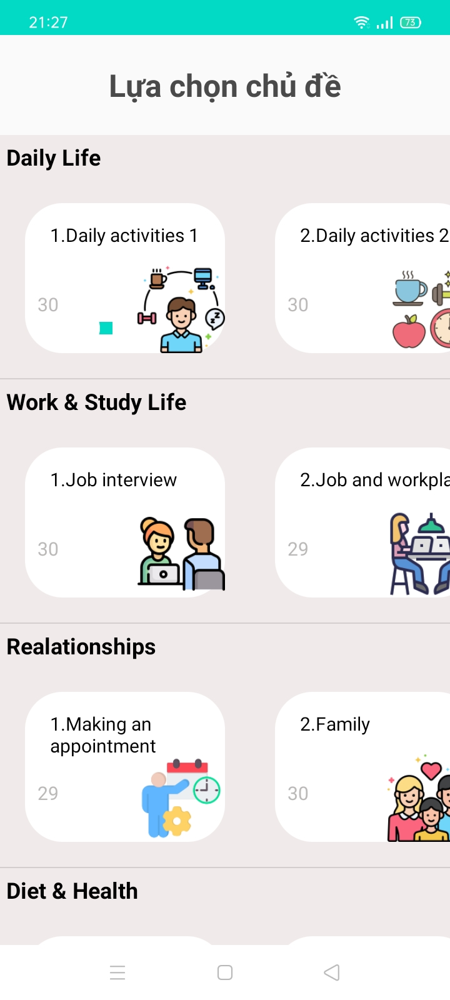
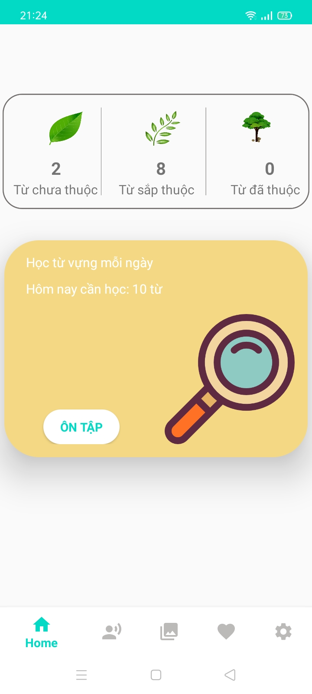
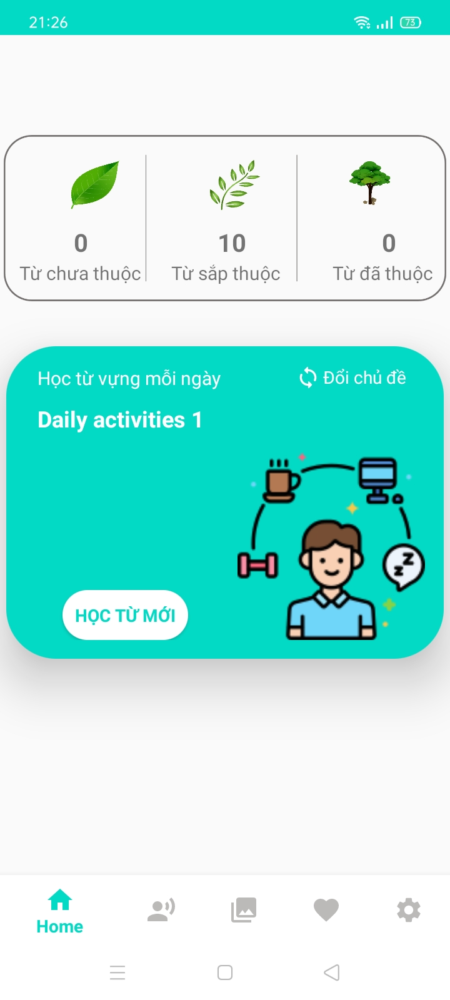
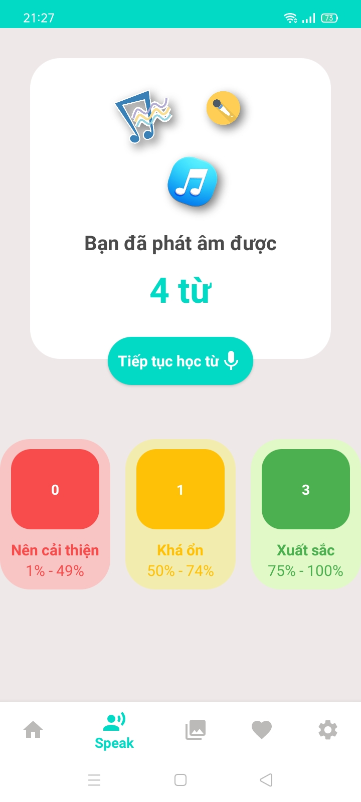
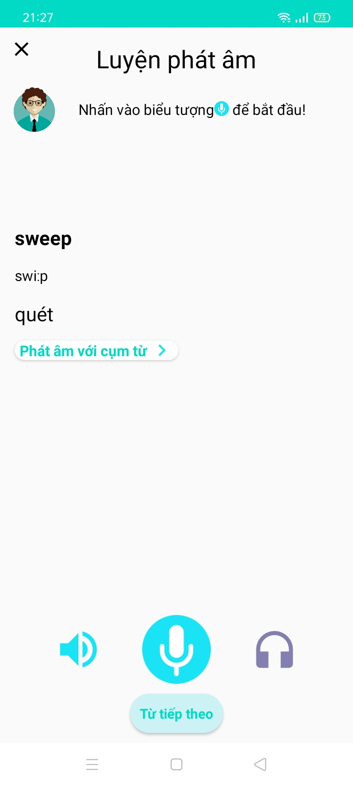
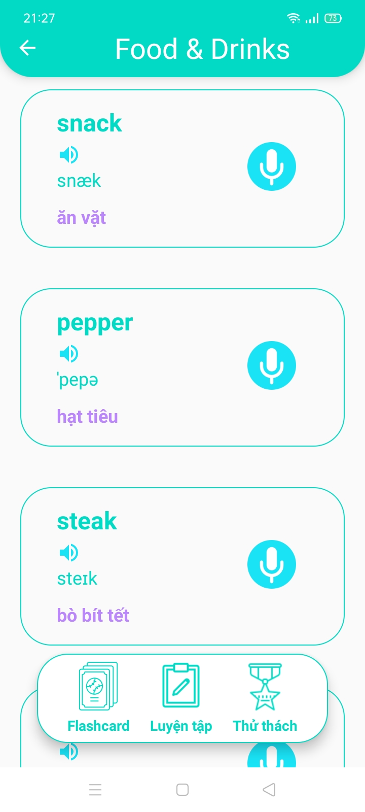
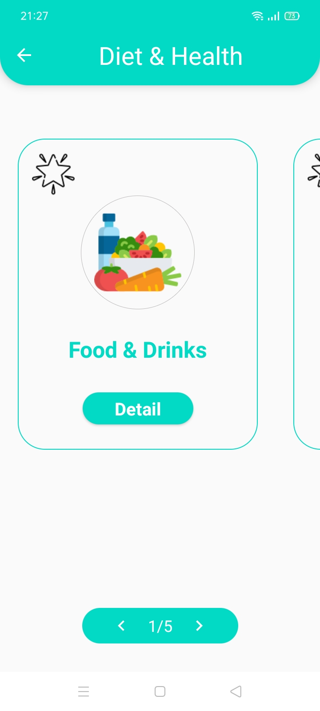

# Learning English
## This is an Android application written in Java with the following features:

### Learn vocabulary and review daily with a variety of topics.

| Topic          | Revise                        | Learning                       |
| --------------| ------------------------------| ------------------------------ |
|  |  |      |

### Learn pronunciation with words and phrases.
- To use the pronunciation assessment feature, you need to add an API key to your project. In this case, we're using Azure's pronunciation assessment API.

|                         |                        |
| ----------------------- | ---------------------- |
|   |  |

### Learn vocabulary with flashcards.

|                         |                        |
| ----------------------- | ---------------------- |
|   |  |

### Various practice functions for different learning styles.

